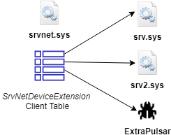

# smbdoor

The proof-of-concept smbdoor.sys driver is a silent remote backdoor that does not bind new sockets or perform function modification hooking. Instead it abuses undocumented APIs in srvnet.sys to register itself as a valid SMB handler. It then listens on the already-bound ports 139/445 for special packets in which to execute secondary shellcode. In several ways, it has similarities with DoublePulsar and DarkPulsar, as well as ToxicSerpent.

Of course, it comes with practical limitations that make it mostly an academic exploration, but I thought it might be interesting to share, and is possibly something EDR products should monitor.
